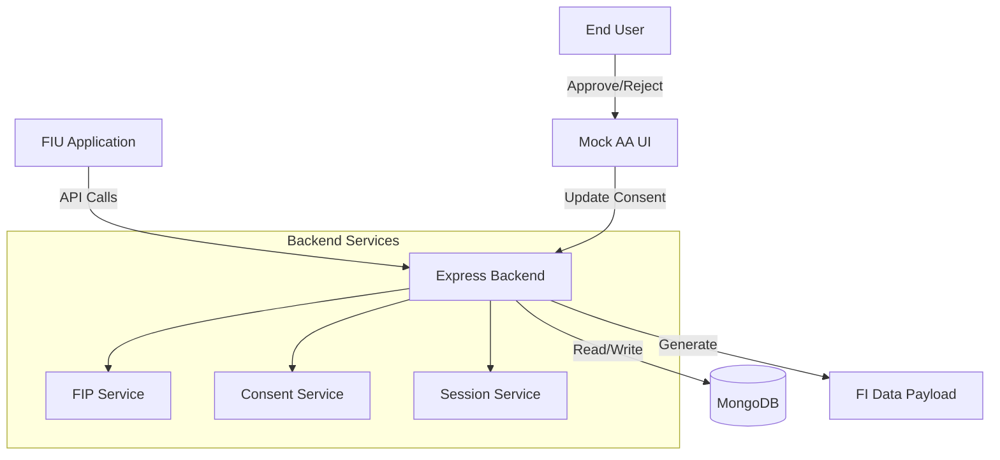
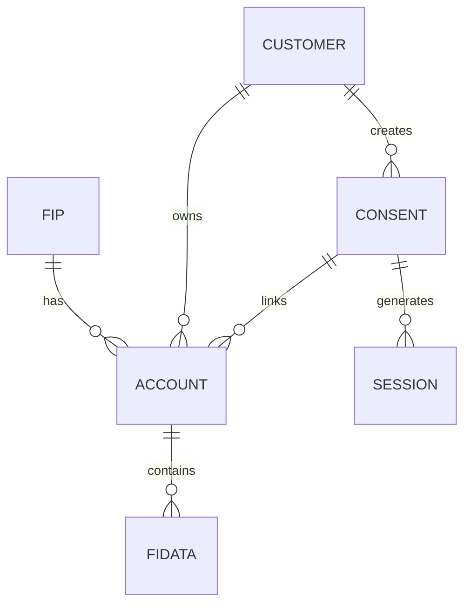

# Mock Account Aggregator + FIU Sandbox

A comprehensive simulation of Setu's Account Aggregator APIs with real state transitions, database persistence, and a mock AA UI for consent management. This sandbox provides a complete testing environment for FIU applications without requiring real RBI compliance, encryption, or signing.

## 🎯 Features

- ✅ **Full AA API Implementation**: Mimics Setu's OpenAPI spec for FIPs, Consents, and Sessions
- ✅ **Real State Transitions**: PENDING → ACTIVE → COMPLETED with proper validation
- ✅ **MongoDB Persistence**: All data stored in MongoDB with Mongoose ODM
- ✅ **Mock AA UI**: Beautiful web interface for consent approval/rejection
- ✅ **Realistic Mock Data**: 100+ transactions across multiple FIPs and account types
- ✅ **Authentication**: Header-based validation (x-client-id, x-client-secret)
- ✅ **Error Handling**: AA-compliant error responses
- ✅ **Swagger UI**: Interactive API documentation and testing interface

## 📚 Interactive API Documentation

Access the **Swagger UI** for interactive API testing:

**http://localhost:3000/api-docs**

Features:
- 🔍 **Try it out**: Test all endpoints directly from the browser
- 🔐 **Easy Authentication**: Set headers once, use everywhere
- 📖 **Complete Schemas**: Detailed request/response documentation
- 💡 **Examples**: Real examples for every endpoint
- 📥 **Export**: Download OpenAPI 3.0 spec at `/api-docs.json`

See [SWAGGER.md](SWAGGER.md) for detailed usage guide.

## 🏗️ Architecture



## 📋 Prerequisites

- Node.js 18+ 
- MongoDB 7.0+
- npm or yarn

**OR**

- Docker & Docker Compose

## 🚀 Quick Start

### Option 1: Local Setup

1. **Clone and navigate to the project**
   ```bash
   cd aa/backend
   ```

2. **Install dependencies**
   ```bash
   npm install
   ```

3. **Set up environment variables**
   ```bash
   cp .env.example .env
   ```
   
   Edit `.env` if needed (default values work for local MongoDB)

4. **Start MongoDB**
   ```bash
   # Using MongoDB service
   mongod
   
   # OR using Docker
   docker run -d -p 27017:27017 --name mongodb mongo:7.0
   ```

5. **Seed the database**
   ```bash
   npm run seed
   ```

6. **Start the server**
   ```bash
   npm run dev
   ```

7. **Verify it's running**
   ```bash
   curl http://localhost:3000/health
   ```

### Option 2: Docker Setup

1. **Start all services**
   ```bash
   docker-compose up -d
   ```

2. **Seed the database**
   ```bash
   docker-compose exec backend npm run seed
   ```

3. **View logs**
   ```bash
   docker-compose logs -f backend
   ```

## 📚 API Endpoints

### Authentication

All API endpoints (except health check and Mock AA UI) require authentication headers:

```bash
x-client-id: mock_fiu_client_123
x-client-secret: mock_secret_key_456
```

### Available Endpoints

| Method | Endpoint | Description |
|--------|----------|-------------|
| GET | `/health` | Health check |
| GET | `/v2/fips` | List all FIPs |
| POST | `/consents` | Create consent request |
| GET | `/consents/:requestId` | Get consent details |
| POST | `/sessions` | Create data fetch session |
| GET | `/sessions/:requestId` | Get FI data |
| GET | `/mock-aa/consents/:consentId` | Mock AA consent approval UI |

## 🔄 Complete Flow Example

### 1. List Available FIPs

```bash
curl -X GET http://localhost:3000/v2/fips \
  -H "x-client-id: mock_fiu_client_123" \
  -H "x-client-secret: mock_secret_key_456"
```

### 2. Create Consent Request

```bash
curl -X POST http://localhost:3000/consents \
  -H "Content-Type: application/json" \
  -H "x-client-id: mock_fiu_client_123" \
  -H "x-client-secret: mock_secret_key_456" \
  -d '{
    "Detail": {
      "Customer": {
        "id": "CUST001"
      },
      "Purpose": {
        "code": "WEALTH_MANAGEMENT"
      },
      "FIDataRange": {
        "from": "2023-01-01T00:00:00Z",
        "to": "2024-12-31T23:59:59Z"
      },
      "DataLife": {
        "unit": "MONTH",
        "value": 6
      },
      "Frequency": {
        "unit": "MONTHLY",
        "value": 1
      },
      "DataFilter": [
        { "type": "DEPOSIT" },
        { "type": "MUTUAL_FUNDS" }
      ]
    },
    "redirectUrl": "https://your-fiu-app.com/callback",
    "consentMode": "VIEW",
    "fetchType": "ONETIME"
  }'
```

**Response:**
```json
{
  "id": "550e8400-e29b-41d4-a716-446655440000",
  "status": "PENDING",
  "url": "http://localhost:3000/mock-aa/consents/550e8400-e29b-41d4-a716-446655440000",
  "redirectUrl": "https://your-fiu-app.com/callback",
  "Detail": { ... }
}
```

### 3. User Approves Consent

Navigate to the `url` from step 2 in a browser:
```
http://localhost:3000/mock-aa/consents/550e8400-e29b-41d4-a716-446655440000
```

- Select accounts to share
- Click "Approve Consent"
- User is redirected to `redirectUrl`

### 4. Check Consent Status

```bash
curl -X GET http://localhost:3000/consents/550e8400-e29b-41d4-a716-446655440000 \
  -H "x-client-id: mock_fiu_client_123" \
  -H "x-client-secret: mock_secret_key_456"
```

**Response:**
```json
{
  "id": "550e8400-e29b-41d4-a716-446655440000",
  "status": "ACTIVE",
  "Detail": {
    "Accounts": [
      {
        "linkRefNumber": "...",
        "maskedAccNumber": "XXXX1234",
        "fiType": "DEPOSIT",
        "fipId": "HDFC_BANK"
      }
    ]
  }
}
```

### 5. Create Data Fetch Session

```bash
curl -X POST http://localhost:3000/sessions \
  -H "Content-Type: application/json" \
  -H "x-client-id: mock_fiu_client_123" \
  -H "x-client-secret: mock_secret_key_456" \
  -d '{
    "consentId": "550e8400-e29b-41d4-a716-446655440000",
    "DataRange": {
      "from": "2024-01-01T00:00:00Z",
      "to": "2024-12-31T23:59:59Z"
    },
    "format": "json"
  }'
```

### 6. Fetch FI Data

```bash
curl -X GET http://localhost:3000/sessions/{sessionId} \
  -H "x-client-id: mock_fiu_client_123" \
  -H "x-client-secret: mock_secret_key_456"
```

**Response:**
```json
{
  "id": "...",
  "consentId": "550e8400-e29b-41d4-a716-446655440000",
  "status": "COMPLETED",
  "DataRange": { ... },
  "format": "json",
  "Payload": [
    {
      "fipID": "HDFC_BANK",
      "data": [
        {
          "linkRefNumber": "...",
          "maskedAccNumber": "XXXX1234",
          "decryptedFI": {
            "fiType": "DEPOSIT",
            "data": [
              {
                "transactionDate": "2024-11-15T10:30:00Z",
                "amount": 5000,
                "type": "CREDIT",
                "merchant": "Salary/Transfer",
                "mode": "NEFT",
                "balance": 45000
              }
            ]
          }
        }
      ]
    }
  ]
}
```

## 🗄️ Database Schema

### Collections

- **fips**: Financial Information Providers
- **customers**: End users
- **accounts**: User accounts at various FIPs
- **consents**: Consent requests and approvals
- **sessions**: Data fetch sessions
- **fidatas**: Mock transaction data

### Relationships



## 🧪 Testing

### Run All Tests
```bash
npm test
```

### Run Integration Tests
```bash
npm run test:integration
```

### Run E2E Tests
```bash
npm run test:e2e
```

## 🎨 Mock AA UI

The mock AA UI provides a beautiful, modern interface for consent approval:

- **Glassmorphism design** with gradient backgrounds
- **Account selection** with checkboxes
- **Consent details** display
- **Approve/Reject** actions
- **Responsive** design

## 📊 Seed Data

The seed script creates:

- **5 FIPs**: HDFC Bank, ICICI Bank, SBI, HDFC MF, ICICI Prudential
- **3 Customers**: Rajesh Kumar, Priya Sharma, Amit Patel
- **9 Accounts**: Mix of deposits, mutual funds, insurance
- **100+ Transactions**: Realistic data over 12 months

### Test Customer IDs

- `CUST001` - Rajesh Kumar (3 accounts)
- `CUST002` - Priya Sharma (3 accounts)
- `CUST003` - Amit Patel (3 accounts)

## 🔧 Configuration

### Environment Variables

| Variable | Description | Default |
|----------|-------------|---------|
| `PORT` | Server port | `3000` |
| `MONGODB_URI` | MongoDB connection string | `mongodb://localhost:27017/aa_sandbox` |
| `CLIENT_ID` | Mock FIU client ID | `mock_fiu_client_123` |
| `CLIENT_SECRET` | Mock FIU client secret | `mock_secret_key_456` |
| `BASE_URL` | Base URL for mock AA | `http://localhost:3000` |

## 🐛 Troubleshooting

### MongoDB Connection Error

```bash
# Check if MongoDB is running
mongosh

# Start MongoDB service
sudo systemctl start mongod
```

### Port Already in Use

```bash
# Change PORT in .env file
PORT=3001
```

### Seed Data Issues

```bash
# Clear and reseed
npm run seed
```

## 📝 License

MIT

## 🤝 Contributing

This is a mock sandbox for testing purposes. Feel free to extend it with additional features!

## 📧 Support

For issues or questions, please open an issue on GitHub.

---

**Built with ❤️ for the Account Aggregator ecosystem**
